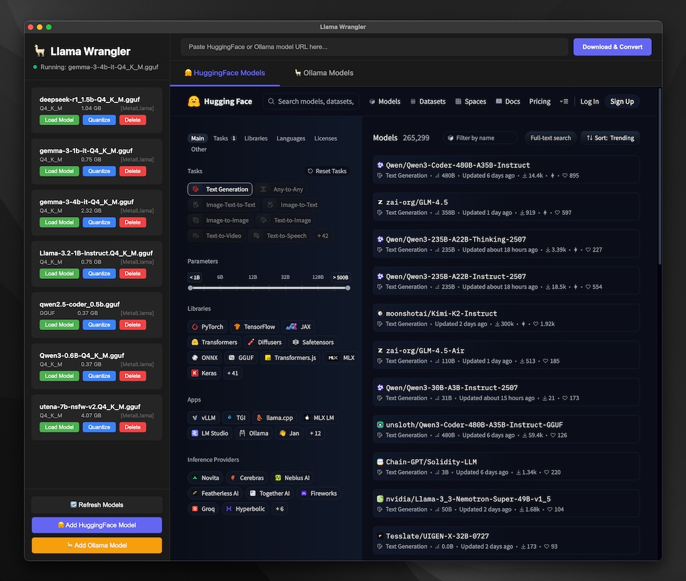

# Llama Wrangler 🦙

> Universal LLM Model Manager - Switch, download, and convert models with ease


[](https://opensource.org/licenses/MIT)
[](https://www.electronjs.org/)
[](https://nodejs.org/)
[](https://github.com/sanchez314c/llama-wrangler/releases)

## 📸 Main Interface



> The Ultimate LLM Model Manager - Switch, Download, and Convert Models with Ease

Llama Wrangler is a powerful desktop application that simplifies managing Large Language Models (LLMs). Built with Electron, it provides a beautiful dark UI for downloading models from HuggingFace and Ollama, automatically converting them to GGUF format, and hot-swapping between models instantly.

## ✨ Features

- 🔄 **Hot-swap Models** - Switch between models instantly without restarting
- 📥 **Universal Downloads** - Support for HuggingFace and Ollama models
- 🔧 **Auto-conversion** - Automatically converts models to GGUF Q4_K_M format
- 🌐 **Built-in Browser** - Browse HuggingFace and Ollama directly in-app
- 🎨 **Beautiful Dark UI** - Modern, responsive interface that's easy on the eyes
- ⚡ **Native Performance** - Built with Electron for optimal performance
- 🖥️ **Cross-Platform** - Works on macOS, Windows, and Linux
- 🚀 **GPU Acceleration** - Automatic detection and support for Metal/CUDA

## 📸 Screenshots

<details>
<summary>View Screenshots</summary>


*Main interface showing model library and active model*


*Built-in browser for discovering models*


*Real-time download and conversion progress*

</details>

## 🚀 Quick Start - One-Command Build & Run

### Option 1: One-Command Solution (Recommended)

```bash
# Clone and build
git clone https://github.com/sanchez314c/llama-wrangler.git
cd llama-wrangler

# Build and run with a single command!
./build-release-run.sh
```

### Option 2: Development Mode

```bash
# Run in development mode with hot reload
./build-release-run.sh --dev
```

### Build Options

```bash
# Build only (don't launch)
./build-release-run.sh --build-only

# Clean build
./build-release-run.sh --clean

# Build for specific platform
./build-release-run.sh --platform mac
./build-release-run.sh --platform win
./build-release-run.sh --platform linux

# Build for all platforms
./build-release-run.sh --platform all
```

### Option 3: Download Pre-built Binary

1. Go to the [Releases](https://github.com/sanchez314c/llama-wrangler/releases) page
2. Download the appropriate version for your platform:
   - **macOS**: `Llama-Wrangler-x.x.x.dmg` (Intel/Apple Silicon)
   - **Windows**: `Llama-Wrangler-Setup-x.x.x.exe`
   - **Linux**: `Llama-Wrangler-x.x.x.AppImage`
3. Install and run the application

## 📋 Prerequisites

For running from source:
- **Node.js** 16+ and npm
- **Python** 3.8+ (for model conversion)
- **Git** (for cloning llama.cpp)

The application will guide you through installing any missing dependencies.

## 🛠️ Installation

### Detailed Installation

```bash
# Clone the repository
git clone https://github.com/sanchez314c/llama-wrangler.git
cd llama-wrangler

# Option 1: Use the install script (if needed)
cd dev && ./install.sh && cd ..

# Option 2: Manual installation
npm install

# Start the application
./build-release-run.sh
```

### Building from Source

```bash
# One-command build for current platform
./build-release-run.sh --build-only

# Build for all platforms
./build-release-run.sh --platform all --build-only

# Build for specific platforms
./build-release-run.sh --platform win --build-only
./build-release-run.sh --platform mac --build-only
./build-release-run.sh --platform linux --build-only
```

### Build Output Locations

After building, find your executables in:
- **macOS**: `dist/Llama Wrangler-*.dmg` and `dist/mac*/Llama Wrangler.app`
- **Windows**: `dist/Llama Wrangler Setup *.exe`
- **Linux**: `dist/Llama Wrangler-*.AppImage` and `dist/*.deb`

## 📖 Usage

### 1. Starting the Application

- **Pre-built Binary**: Just double-click the application
- **From Source**: Run `./runWRANGLER.sh`

### 2. Browsing Models

The app includes two browser tabs:
- **HuggingFace**: Browse trending text generation models
- **Ollama**: Explore curated Ollama models

Navigate to any model page and the URL will automatically populate in the download field.

### 3. Downloading Models

Two ways to download:
1. **Browse & Copy**: Navigate to a model page, then click "Download & Convert"
2. **Direct Input**: Paste a HuggingFace URL or Ollama model name

Examples:
```
# HuggingFace URLs
https://huggingface.co/mistralai/Mistral-7B-Instruct-v0.3
https://huggingface.co/meta-llama/Llama-2-7b-chat-hf

# Ollama model names
llama3.2
mistral
codellama
```

### 4. Managing Models

- **Switch Models**: Click any model in the sidebar to activate it
- **Active Indicator**: Green dot shows the currently active model
- **Delete Models**: Right-click on a model to delete it
- **Model Info**: See model size and quantization type

### 5. Server Configuration

The app runs a local llama.cpp server on port 7070 with:
- Maximum GPU layers (999)
- 8192 token context size
- Automatic GPU detection (Metal/CUDA)

## 🔧 Configuration

### Directory Structure

```
~/.llama-wrangler/
├── models/          # Downloaded GGUF models
├── llama.cpp/       # llama.cpp installation
├── config.json      # App configuration
└── logs/            # Application logs
```

### Environment Variables

```bash
# Set custom model directory
export LLAMA_MODELS_DIR=/path/to/models

# Set custom port
export LLAMA_SERVER_PORT=8080

# Disable GPU
export LLAMA_NO_GPU=1
```

## 🐛 Troubleshooting

### Common Issues

<details>
<summary>llama.cpp not found</summary>

The app will prompt to install automatically. If that fails:
```bash
cd ~/.llama-wrangler
git clone https://github.com/ggerganov/llama.cpp
cd llama.cpp
make -j
```
</details>

<details>
<summary>Python dependencies missing</summary>

Install required packages:
```bash
pip3 install huggingface-hub requests
```
</details>

<details>
<summary>Model won't load</summary>

1. Check the model is fully downloaded (no .tmp files)
2. Ensure you have enough RAM (2x model size recommended)
3. Try restarting the app
4. Check logs in `~/.llama-wrangler/logs/`
</details>

<details>
<summary>GPU not detected</summary>

- **macOS**: Metal should work automatically
- **Linux/Windows**: Ensure CUDA is installed and llama.cpp was built with CUDA support
- Rebuild llama.cpp with appropriate flags
</details>

## 📁 Project Structure

```
LlamaWrangler/
├── build-release-run.sh  # One-command build & run script
├── package.json          # Node.js configuration
├── main.js              # Electron main process
├── preload.js           # Preload script
├── renderer.js          # Renderer process
├── index.html           # Application UI
├── webview-preload.js   # WebView preload script
├── assets/              # Application assets
│   ├── icon.png        # Application icon
│   ├── icon.ico        # Windows icon
│   └── icon.icns       # macOS icon
├── dev/                 # Development files
│   ├── CONTRIBUTING.md # Contribution guidelines
│   ├── QUICK_REFERENCE.md # Quick reference guide
│   ├── changelog.md    # Version history
│   ├── breadcrumbs.md  # Development notes
│   └── install.sh      # Setup helper
├── _archive/           # Archived/backup files
├── scripts/            # Utility scripts
│   ├── download_hf.py  # HuggingFace downloader
│   └── download_ollama.py # Ollama downloader
├── screenshots/        # Application screenshots
└── dist/              # Build outputs (created after build)
```

## 🤝 Contributing

We welcome contributions! Please see our [Contributing Guidelines](dev/CONTRIBUTING.md) for details.

### Development Setup

```bash
# Clone the repo
git clone https://github.com/sanchez314c/llama-wrangler.git
cd llama-wrangler

# Install dependencies
npm install

# Run in development mode
./build-release-run.sh --dev

# Run tests
npm test

# Lint code
npm run lint
```

## 📄 License

This project is licensed under the MIT License - see the [LICENSE](LICENSE) file for details.

## 🙏 Acknowledgments

- [llama.cpp](https://github.com/ggerganov/llama.cpp) - The amazing inference engine that powers model execution
- [Ollama](https://ollama.ai) - For model curation and inspiration
- [HuggingFace](https://huggingface.co) - For hosting the world's LLMs
- [Electron](https://www.electronjs.org/) - For making cross-platform development possible
- The open-source AI community for making all of this possible

## 🔗 Links

- [Report Issues](https://github.com/sanchez314c/llama-wrangler/issues)
- [Request Features](https://github.com/sanchez314c/llama-wrangler/issues/new?labels=enhancement)
- [Discussions](https://github.com/sanchez314c/llama-wrangler/discussions)

---

<p align="center">
  Made with 🦙 and ❤️ by Jasonn Michaels
</p>