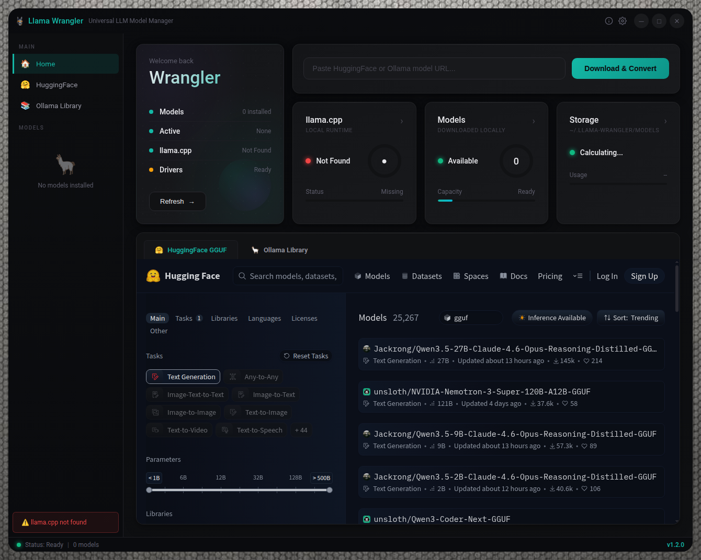

# Llama Wrangler

> Universal LLM Model Manager — download, convert, and hot-swap models with a single click.

[](https://github.com/sanchez314c/llama-wrangler/releases)
[](LICENSE)
[](https://www.electronjs.org/)
[](https://nodejs.org/)
[](https://github.com/sanchez314c/llama-wrangler/releases)

Llama Wrangler is a cross-platform desktop app built on Electron that lets you browse HuggingFace and Ollama, download models directly to your machine, auto-convert them to GGUF format, and hot-swap between them — all without leaving the app. The app runs a local llama.cpp inference server on port 7070 and manages the full lifecycle of that server when you switch models.

<p align="center">
  
</p>

## Features

- **Hot-swap models** — switch the active model without restarting anything
- **Embedded browser** — browse HuggingFace and Ollama directly in-app; URLs auto-populate the download field when you land on a model page
- **Smart downloads** — detects pre-quantized GGUF files first; falls back to downloading + converting the base model if none exist
- **In-app quantization** — re-quantize any local GGUF to Q2_K through Q8_0 using llama-quantize
- **Model management** — view size, quantization type, and source location; delete models from the sidebar
- **GPU auto-detection** — uses Metal on macOS, CUDA on Linux/Windows when available
- **Neo-Noir UI** — frameless transparent window with a dark glassmorphism dashboard

## Quick Start

```bash
git clone https://github.com/sanchez314c/llama-wrangler.git
cd llama-wrangler
npm install
./run-source-linux.sh    # Linux
./run-source-macos.sh    # macOS
```

See [docs/QUICK_START.md](docs/QUICK_START.md) for a step-by-step walkthrough.

## Prerequisites

| Dependency | Version | Required For |
|------------|---------|-------------|
| Node.js | 18+ (22 recommended) | Running the app |
| Python | 3.8+ | Model downloads and conversion |
| `huggingface-hub` | latest | HuggingFace downloads |
| `requests`, `tqdm` | latest | Download progress |
| llama.cpp | built locally | Serving models |

Install Python deps:

```bash
pip install huggingface-hub requests tqdm
```

The app will prompt to install llama.cpp on first launch if it is not found at `~/.llama-wrangler/llama.cpp/` or `~/.METALlama.cpp/`.

## Installation

### From a pre-built binary

Download the release for your platform from [Releases](https://github.com/sanchez314c/llama-wrangler/releases):

- **macOS**: `Llama Wrangler-1.2.0.dmg` (Intel, Apple Silicon, or Universal)
- **Windows**: `Llama Wrangler Setup 1.2.0.exe` or `.msi`
- **Linux**: `Llama Wrangler-1.2.0.AppImage` or `.deb` / `.rpm`

### Build from source

```bash
npm install
npm run build          # current platform
npm run dist:mac       # macOS (Intel + ARM)
npm run dist:win       # Windows
npm run dist:linux     # Linux
npm run dist:maximum   # all platforms, all architectures
```

Built artifacts land in `dist/`.

## Usage

### Downloading a model

1. Navigate to a model page in the HuggingFace or Ollama browser tab — the URL auto-populates.
2. Alternatively, paste a URL or Ollama model name into the download field manually.
3. Click **Download & Convert**.

Supported inputs:

```
https://huggingface.co/mistralai/Mistral-7B-Instruct-v0.3
https://huggingface.co/TheBloke/Llama-2-7B-Chat-GGUF
llama3.2
mistral
codellama
```

### Switching models

Click any model in the sidebar. A dialog offers **Load**, **Quantize**, or **Delete**. Choosing Load stops the current llama.cpp server, starts a new one with that model, and polls `http://localhost:7070/v1/models` until ready (up to 30 seconds).

### Quantizing a model

Open the action dialog for any local model and choose **Quantize**. Select a target level (Q2_K through Q8_0). The app calls `llama-quantize` and saves the output alongside the source file.

### Server configuration

The llama.cpp server runs on port 7070 with:
- Context size: 8192 tokens
- GPU layers: 999 (auto-detects available VRAM)
- Host: 0.0.0.0 (accessible from localhost and LAN)

The server exposes an OpenAI-compatible API. Point any OpenAI client at `http://localhost:7070`.

### Local storage

```
~/.llama-wrangler/
├── models/          # Downloaded GGUF files
└── llama.cpp/       # Auto-installed llama.cpp
```

## Project Structure

```
llama-wrangler/
├── src/
│   ├── main.js              # Electron main process, IPC handlers, server management
│   ├── renderer.js          # UI logic, model list, download/quantize dialogs
│   ├── preload.js           # Secure IPC bridge exposed to renderer
│   ├── webview-preload.js   # CSS injection and security for embedded webviews
│   └── index.html           # Dashboard UI (Neo-Noir glassmorphism)
├── scripts/
│   ├── download_hf.py       # HuggingFace model downloader + GGUF converter
│   ├── download_ollama.py   # Ollama registry downloader
│   ├── compile-build-dist.sh
│   └── bloat-check.sh
├── resources/
│   ├── icons/               # .icns, .ico, .png
│   └── screenshots/
├── docs/                    # Full documentation suite
├── .github/                 # Issue templates, PR template, CI workflows
├── archive/                 # Timestamped backups
├── package.json
└── run-source-linux.sh / run-source-macos.sh / run-source-windows.bat
```

## Troubleshooting

**llama.cpp not found** — the app shows a dialog to either select an existing build or install automatically. You can also point it at an existing build via the directory picker.

**Download fails with "pip install" error** — `pip install huggingface-hub requests tqdm`

**Server port 7070 in use** — check with `lsof -i :7070` (macOS/Linux) or `netstat -ano | findstr :7070` (Windows) and kill the conflicting process.

**App won't launch on Linux (Permission denied)** — run `sudo sysctl -w kernel.unprivileged_userns_clone=1` or launch with `--no-sandbox`.

See [docs/TROUBLESHOOTING.md](docs/TROUBLESHOOTING.md) for the full guide.

## Contributing

Pull requests are welcome. See [CONTRIBUTING.md](CONTRIBUTING.md) for code style, commit format, and the PR process.

## License

MIT — see [LICENSE](LICENSE).

## Acknowledgments

- [llama.cpp](https://github.com/ggerganov/llama.cpp) for the inference engine
- [HuggingFace](https://huggingface.co) for hosting models
- [Ollama](https://ollama.ai) for model curation
- [Electron](https://www.electronjs.org/) for the cross-platform framework
